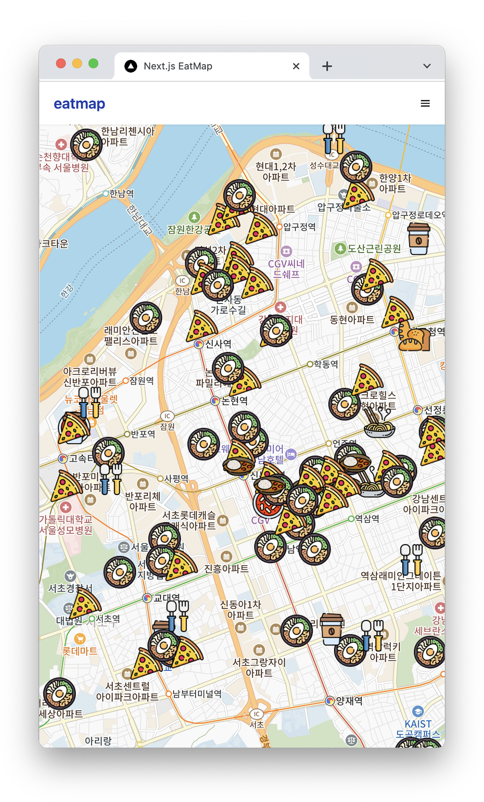
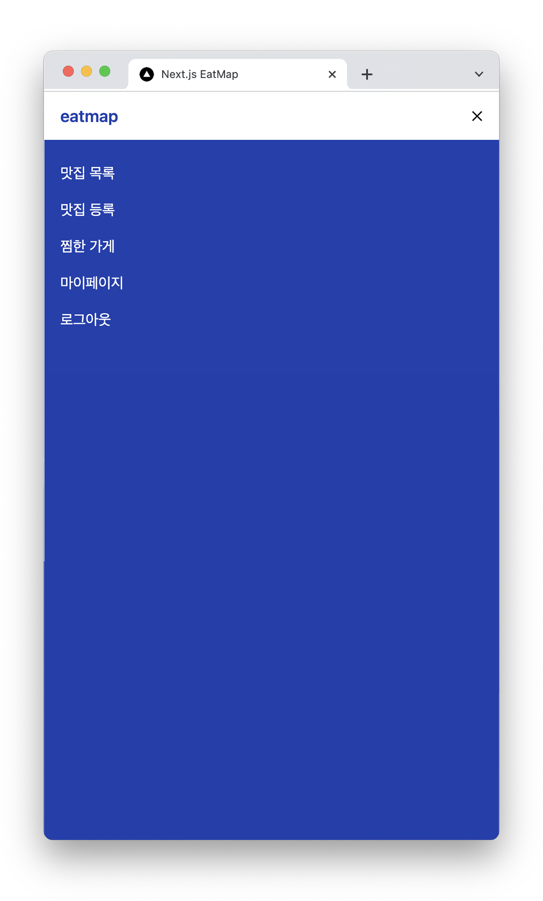
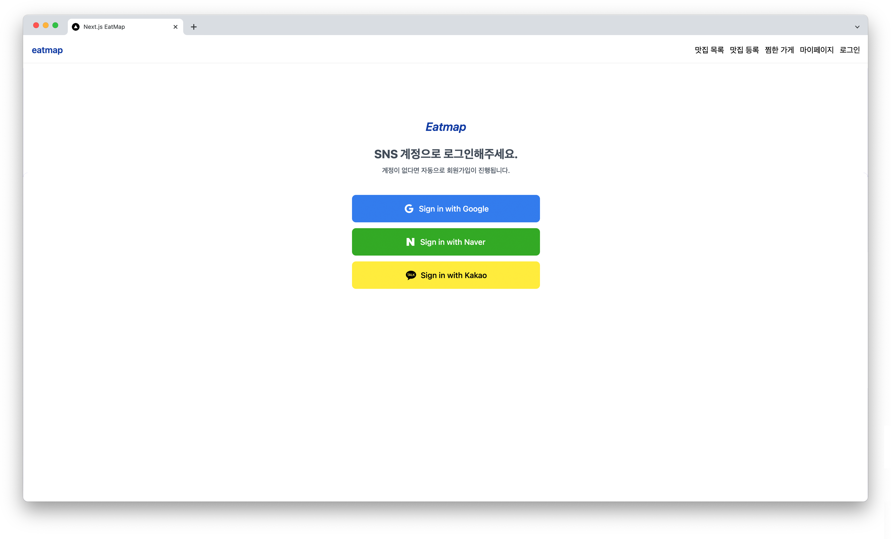
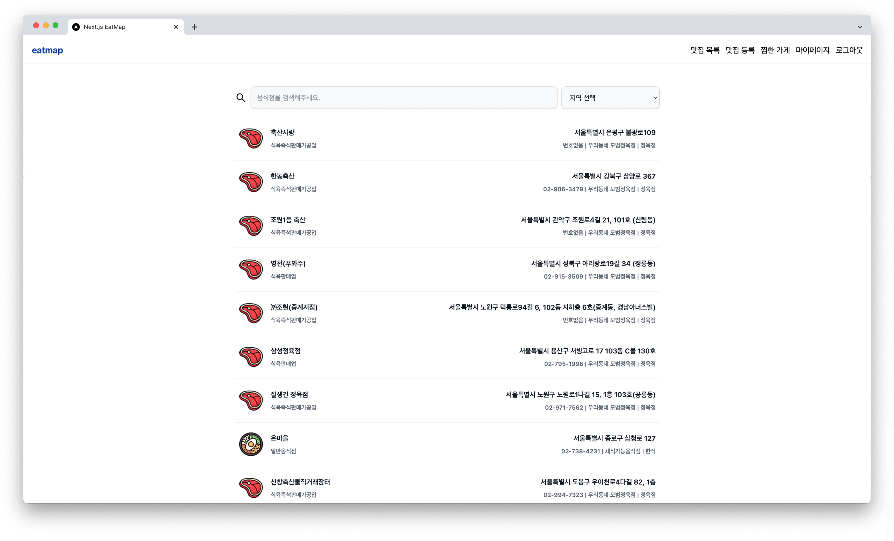
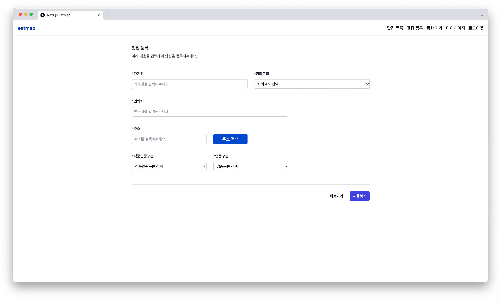
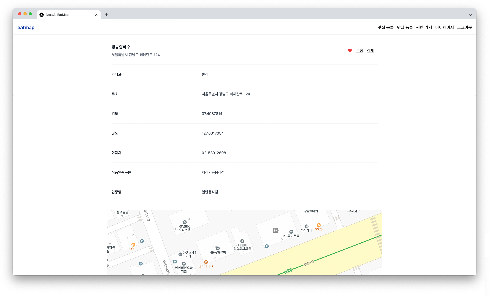

# 🍳 Next.js 맛집 지도

> 👉 [사이트 바로가기](https://next-eatmap-five.vercel.app/) 

 

## 📋 Project

- 이 프로젝트는 Next.js 구조 및 SSR 개념을 이해하기 위해 제작한 맛집 지도 프로젝트입니다.  
  맛집 목록/정보/등록, 찜하기, 댓글 등의 기능을 구현했습니다. 
  Next.js의 API Routes를 기반으로 API를 호출하고 Prisma & Supabase를 이용해 데이터를 처리했습니다.  
  Recoil로 전역 상태관리를 구현했습니다. React-Query로 캐싱하고 infinite scroll을 구현했습니다. 
  맛집 공공데이터를 가져와 Kakao Map API를 연동하여 지도 위에 마커를 표시하고, 클릭하면 상세 정보를 확인할 수 있습니다.
  Next-Auth로 사용자 인증 및 SNS 로그인을 구현했습니다.  
  Velcel에 Github을 연동하여 자동으로 배포하고 Google Analytics를 적용했습니다. 
  Geolocation API로 사용자의 현재 위치를 기반으로 정보를 가져올 수 있습니다.

 

## 💡 학습

- 웹 구조 : Next.js SSR
- 스타일링 : 심화된 스택 사용을 위한 Tailwind
- 상태관리 : 전역 상태관리를 위한 Recoil + 캐싱을 위한 React-query
- 백엔드 관련 : 외부 API 연동(카카오 지도 & 위치 정보 가져오기)과 데이터 처리에 대한 경험(Prisma)
  - [ **Kakao map API** ](https://developers.kakao.com/)에서 앱 생성 후, Javascript 키 필요
  - [ **Supabase** ](https://supabase.com/)에서 프로젝트 세팅 필요
  - [ **Next-auth & Prisma** ](https://authjs.dev/reference/adapter/prisma)
    - [Prisma Adapter](https://authjs.dev/reference/adapter/prisma) 세팅 필요
    - [Middleware](https://next-auth.js.org/configuration/nextjs#middleware) 세팅 필요
    - [Google](https://console.developers.google.com/apis/credentials)에서 API키 생성필요
    - [Naver](https://developers.naver.com/main/)에서 오픈 API 이용 신청 및 서비스 URL에 로컬 호스트 추가 필요
    - [Kakao](https://developers.kakao.com/)에서 앱 등록 후 동의 항목 설정 및 API키, 활성화 필요
- 배포 관련: CI/CD(Vercel)

 

## ⚙️ 사용 스택

  
  
  
  
  
  
  
  
  
<!--    -->
  
  

 

## 🛠️ 프로젝트 실행

- Yarn으로 Next.js앱을 설치합니다. `yarn create next-app`
- React-Icons를 설치합니다. `yarn add react-icons`
- Prisma를 설치합니다. `yarn add --dev prisma` `yarn add @prisma/client` `yarn add --dev ts-node`
- React Query를 설치합니다. `yarn add react-query`
- Axios를 설치합니다. `yarn add axios`
- Next-auth를 설치합니다. `yarn add next-auth` `yarn add @auth/prisma-adapter`
- Recoil을 설치합니다. `yarn add recoil`
- React Hook Form을 설치합니다. `yarn add react-hook-form`
- React-Toastify을 설치합니다. `yarn add react-toastify`
- React Daum Postcode를 설치합니다. `yarn add react-daum-postcode`
- Vercel CLI를 설치합니다. `yarn global add vercel`
- 프로젝트 시작 `yarn dev`

 

## 🔑 페이지 설명

메인 페이지

- 맛집 목록 전체보기
- Kakao Map API로 지도 위에 맛집 마커 표시
- 맛집 클릭 시 상세 정보 확인 가능
- 찜하기 가능
- Next-auth를 이용한 사용자 인증 관리 및 SNS 로그인·로그아웃 가능
- 로그인 시 메인 페이지로 라우터 이동
- Geolocation API을 활용한 현재위치 가져오기 적용

맛집 목록 / 맛집 등록

- 맛집 목록
  - React-query의 infinite scroll을 이용해 로딩 및 무한 스크롤 구현
  - Recoil를 이용한 키워드 검색 & 위치 검색 필터링
  - 상세 정보 확인 가능
    - 맛집 정보 수정 및 삭제 가능
    - 찜하기 기능, 비로그인 시 로그인 필요 토스트창 노출
    - 특정 맛집 주소의 마커만 표시한 지도 확인 가능
    - 댓글 등록 및 삭제 가능, 댓글이 5개 이상일 경우 페이지네이션 기능 구현

- 맛집 등록
  - 비로그인 시 로그인 페이지로 이동
  - 로그인 한 경우 맛집 등록 페이지 노출
  - 새로운 가게 등록 가능
  - Daum 주소 API를 활용해 주소 검색

찜한 가게

- 찜한 맛집 리스트
  - 비로그인 시 로그인 페이지로 이동
  - 로그인 한 경우 해당 유저의 찜한 맛집 리스트 확인 가능
  - 찜한 맛집이 10개 이상일 경우 페이지네이션 기능 구현
  - 맛집 클릭시 상세정보로 이동

마이페이지

- 유저 정보
  - 비로그인 시 로그인 페이지로 이동
  - 로그인 한 경우 해당 유저의 정보 확인 가능
  - 로그아웃 가능
  - 내가 쓴 댓글 리스트 확인 가능, 등록한 댓글의 맛집 상세 정보로 이동 가능

## 🖥️ Screenshots

  
  
  

